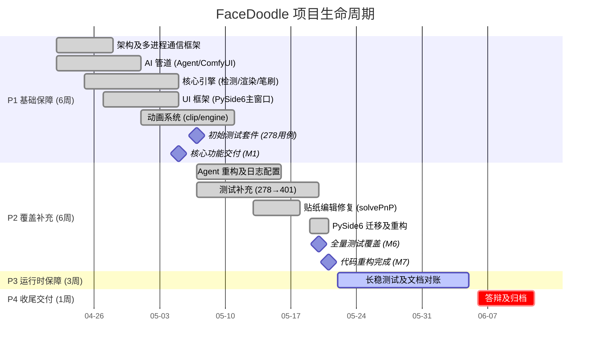
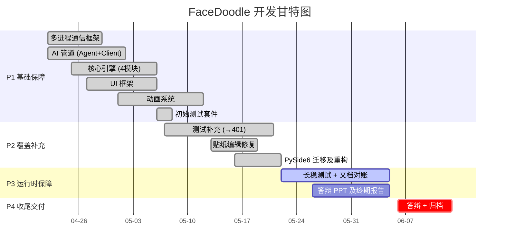
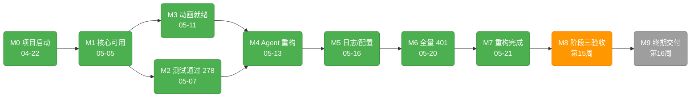
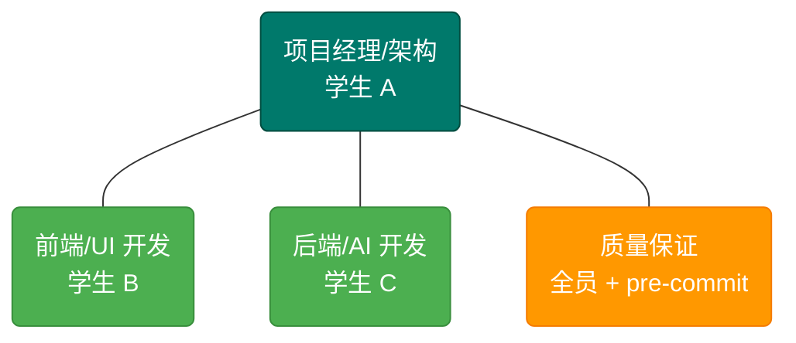

# FaceDoodle 项目管理报告

---

**版本**: v1.1
**日期**: 2026-05-31
**项目类型**: 课程项目
**方法论**: 瀑布式阶段划分 + 敏捷式迭代开发

---

## 1. 项目概述

### 1.1 项目背景

FaceDoodle 是一款 AR 面部贴纸生成与编辑桌面应用。用户通过自然语言描述需求，DeepSeek 多轮对话解析意图，ComfyUI（SDXL + Layer Diffusion）自动生成透明 PNG 贴纸并贴合到人脸上。支持手绘、简笔画 ControlNet 精炼、关键帧动画、面部直接绘制等功能。

### 1.2 项目目标

| 维度 | 目标 | 当前达成 |
|------|------|:------:|
| 功能 | 聊天式 AI 贴纸生成 + 编辑 + 动画 + 面部绘制 | 100% |
| 质量 | 401 用例全量通过，核心模块 100% 测试覆盖 | 100% |
| 性能 | 渲染帧率 ≥ 15 FPS（720p） | 待验收 |
| 文档 | 5 份技术文档 + 1 份项目管理报告 | 100% |
| 交付 | 源码 + 可执行脚本 + 答辩材料 | 进行中 |

### 1.3 技术栈

| 层 | 技术 | 选型理由 |
|---|------|---------|
| 运行时 | Python 3.10+ | 生态丰富，AI/视觉库支持好 |
| 桌面 UI | PySide6 (Qt) | 现代组件库，Teal 主题系统视觉效果更好 |
| 人脸检测 | MediaPipe | Google 维护，开箱即用 468 关键点 |
| AI 对话 | DeepSeek API | 中文能力强，成本极低（¥1/1M token） |
| AI 图像 | ComfyUI REST API | SDXL + LayerDiffusion 工作流编排 |
| 进程通信 | Python multiprocessing.Queue | 标准库，无额外依赖 |
| 测试 | pytest | 生态成熟，fixture 机制灵活 |
| 版本控制 | Git + pre-commit hooks | 自动化质量关卡 |

### 1.4 项目生命周期

采用**混合型生命周期**：宏观上按瀑布模型的 4 个阶段递进（P1→P2→P3→P4），微观上每阶段内按敏捷模式迭代（每 1-2 天一个增量提交）。



---

## 2. 范围管理

### 2.1 工作分解结构（WBS）

```
FaceDoodle 1.0
├── 1.0 项目管理
│   ├── 1.1 项目计划与跟踪
│   ├── 1.2 风险管理
│   ├── 1.3 质量保证
│   └── 1.4 文档管理
├── 2.0 系统架构
│   ├── 2.1 多进程通信框架（8 队列）
│   ├── 2.2 Protocol 消息体系（6 类 50+ dataclass）
│   ├── 2.3 Consumer 主循环（14 步流水线）
│   └── 2.4 配置管理 + 日志系统
├── 3.0 AI 集成
│   ├── 3.1 DeepSeek Agent（多轮对话 + 关键词降级）
│   ├── 3.2 ComfyUI 客户端（REST API + 轮询）
│   ├── 3.3 ComfyUI 子进程管理（自动启停）
│   ├── 3.4 工作流注入（Prompt/LoRA/Seed/ControlNet）
│   └── 3.5 风格预设系统（4 个内置预设）
├── 4.0 核心引擎
│   ├── 4.1 人脸检测（MediaPipe 468 点）
│   ├── 4.2 贴纸渲染（透视贴合 + 头部位姿）
│   ├── 4.3 笔刷引擎（PNG 蒙版 + 压感）
│   ├── 4.4 面部绘制（逆透视映射 + 撤销栈）
│   └── 4.5 模板系统（9 张内置模板）
├── 5.0 动画系统
│   ├── 5.1 关键帧引擎（clip/engine）
│   ├── 5.2 纹理动画（精灵表 + AnimateDiff）
│   ├── 5.3 动画导出（GIF/MP4）
│   └── 5.4 动画时间轴 UI
├── 6.0 用户界面
│   ├── 6.1 主窗口 + 画廊管理
│   ├── 6.2 聊天面板（多轮对话气泡）
│   ├── 6.3 贴纸编辑（移动/旋转/缩放/重置）
│   ├── 6.4 面部绘制面板
│   ├── 6.5 动画时间轴 + 生成对话框
│   └── 6.6 设置对话框 + 快捷键系统
├── 7.0 测试体系
│   ├── 7.1 单元测试（18 文件 401 用例）
│   ├── 7.2 Pre-commit 自动化关卡
│   └── 7.3 Mock 模式集成测试
└── 8.0 文档交付
    ├── 8.1 技术报告 (TECHNICAL_REPORT.md)
    ├── 8.2 质量计划 (QUALITY_PLAN.md)
    ├── 8.3 风险管理计划 (RISK_MANAGEMENT_PLAN.md)
    ├── 8.4 成本估算 (COST_ESTIMATION.md)
    ├── 8.5 项目管理报告 (PROJECT_MANAGEMENT.md)
    └── 8.6 用户手册 (README.md)
```

### 2.2 范围变更记录

| 日期 | 变更 | 类型 | 原因 |
|------|------|:----:|------|
| 05-16 | PyQt5 → PySide6 迁移 | 技术替换 | 统一 Teal 主题视觉风格，界面更现代 |
| 05-17 | 多视角贴纸合成 → Revert | 移除 | 引入渲染不稳定，回退 |
| 05-18 | WebSocket 实时预览 → 移除 | 移除 | 冷却回退不稳定，改回轮询 |
| 05-19 | StickerRegistry 域模型提取 | 新增 | 解耦 active_stickers/adjustments 字典 |

### 2.3 需求追溯矩阵

| 需求 ID | 需求描述 | 对应 WBS | 验证方式 |
|:------:|---------|:------:|---------|
| R01 | 自然语言描述生成透明 PNG 贴纸 | 3.1, 3.2 | Mock 模式集成测试 |
| R02 | 贴纸透视贴合到面部 | 4.1, 4.2 | `test_renderer.py` |
| R03 | 拖拽/旋转/缩放编辑 | 6.3 | 手动测试 |
| R04 | 关键帧动画播放与导出 | 5.1, 5.3 | `test_animation.py` |
| R05 | AI 纹理动画生成 | 3.2, 5.2 | 真实 ComfyUI 测试 |
| R06 | 面部直接绘制（笔刷 + 压感） | 4.3, 4.4 | `test_face_draw.py` |
| R07 | 简笔画 ControlNet 精炼 | 3.2 | 真实 ComfyUI 测试 |
| R08 | 风格预设切换 | 3.5 | 手动测试 |
| R09 | 无 API Key 关键词降级 | 3.1 | `test_agent.py` |
| R10 | 贴纸持久化存储 | 2.4 | `test_storage.py` |

---

## 3. 时间管理

### 3.1 里程碑计划

| 里程碑 | 日期 | 交付物 | 状态 |
|--------|:----:|------|:----:|
| M0 项目启动 | 04-22 | 仓库初始化、技术选型 | ✅ |
| M1 核心功能可用 | 05-05 | 贴纸生成 + 编辑 + 透视贴合 | ✅ |
| M2 初始测试套件 | 05-07 | 12 文件 278 用例通过 | ✅ |
| M3 动画系统就绪 | 05-11 | 关键帧引擎 + 时间轴 UI | ✅ |
| M4 Agent 重构完成 | 05-13 | DeepSeek 多轮对话 + 降级 | ✅ |
| M5 日志/配置完善 | 05-16 | 全模块 logging + 风格预设 | ✅ |
| M6 全量测试覆盖 | 05-20 | 18 文件 401 用例通过 | ✅ |
| M7 代码重构完成 | 05-21 | PySide6 迁移 + StickerRegistry | ✅ |
| M8 阶段三验收 | 第 15 周 | 长稳测试 + 文档对账 | ✅ |
| M9 终期交付 | 第 16 周 | 答辩 + 归档 | ⚪ |

### 3.2 甘特图



### 3.3 关键路径分析



关键路径上的延迟会直接推后项目交付。**M2→M4→M5→M6** 是最长依赖链，实际执行中 M6（测试补充）是约束瓶颈——从 278 用例扩展到 401 用例用了 13 天。

---

## 4. 成本管理

本项目为课程作业，无资金投入。唯一实际支出为 DeepSeek API 调用费用。因此成本管理侧重于**人力投入的度量和跟踪**——以机会成本法将学生时间折算为经济等价物，便于与其他项目横向对比和课程评分。

### 4.1 成本构成

| 类别 | 金额（元） | 说明 |
|------|:-----:|------|
| DeepSeek API（480 次调用） |   1   |  |
| 其他工具/服务 |   0   | PyCharm Community、GitHub、ComfyUI 等均为免费 |
| **资金支出合计** | **1** | |

### 4.2 人力投入

| 阶段 | 人时 | 占总人时 | 状态 |
|:----:|:----:|:------:|:----:|
| P1 基础保障 | 290h | 40% | ✅ |
| P2 覆盖补充 | 250h | 35% | ✅ |
| P3 运行时保障 | 110h | 15% | 🔵 |
| P4 收尾交付 | 70h | 10% | ⚪ |
| **合计** | **720h** | **100%** | |

> 3 人 × 15 小时/周 × 16 周 = 720 人时。若按本科生 IT 实习时薪 35 元折算，机会成本约 **25,200 元**。

### 4.3 成本控制

课程项目成本控制重点在于**时间**而非资金：

- 每周站立会同步进度，偏差超过 1 天即调整分工
- 关键路径（§3.3）上的里程碑严格按日期交付
- P3 阶段余量仅 3 周，不再引入新功能，聚焦验收与打磨

---

## 5. 质量管理

### 5.1 质量方针

1. **测试先行**——修改代码后运行全量测试套件；无测试覆盖的新增代码须补测试
2. **三关验证**——语法检查 → 测试套件 → 运行时烟雾测试，任一一关失败不提交
3. **协议不可变**——跨进程消息使用 typed dataclass，禁用裸 dict
4. **自动化优先**——能自动化的关卡必须自动化（pre-commit hooks），不依赖记忆

### 5.2 质量度量

| 指标 | 目标 | 实际 | 达成 |
|------|:----:|:----:|:----:|
| 单元测试覆盖率 | ≥ 80%（核心 100%） | 全部核心模块有测试 | ✅ |
| 测试通过率 | 100% | 401/401 | ✅ |
| 语法检查通过率 | 100% | 100% | ✅ |
| AI 关键词降级覆盖 | 9 区域 60 关键词 | 9 区域 60 关键词 | ✅ |
| 已知竞态/死锁 | 0 | 0 | ✅ |
| 渲染帧率 ≥ 15 FPS | 720p | 待 P3 验收 | 🔵 |

### 5.3 质量保证活动

| 活动 | 频次 | 工具 | 责任人 |
|------|:----:|------|:------:|
| 语法编译检查 | 每次 commit | `scripts/check_syntax.py` | 全员 + pre-commit |
| 单元/回归测试 | 每次 commit | `pytest tests/ -v` | 全员 + pre-commit |
| Mock 模式烟雾测试 | 非平凡变更 | `python app/main.py --mock` | 学生 A |
| 真实模式集成测试 | AI 相关变更 | `python app/main.py` | 学生 A |
| 文档同步检查 | 功能变更 | 手动 | 全员 |

---

## 6. 风险管理

### 6.1 风险登记册

| ID | 风险描述 | S | O | D | RPN | 等级 | 应对策略 | 当前状态 |
|----|---------|:---:|:---:|:---:|:---:|:----:|---------|:------:|
| E1 | 修改引入回归 | 7 | 9 | 9 | **567** | 致命 | 401 自动化测试 + pre-commit 强制 | ✅ 已关闭 |
| T1 | ComfyUI 无响应 | 9 | 7 | 6 | **378** | 致命 | 超时重试 + Mock 降级 + 健康检查 | 🔵 缓解中 |
| E2 | 故障无法定位 | 6 | 7 | 8 | **336** | 高 | 全模块 logging + ERROR 落盘 | ✅ 已关闭 |
| T2 | 线程竞态崩溃 | 9 | 4 | 7 | **252** | 高 | GenerationState 锁 + typed dataclass | ✅ 已关闭 |
| T3 | 中文路径加载失败 | 8 | 7 | 4 | **224** | 高 | 统一 fromfile+imdecode | 🔵 70% |
| R1 | API Key 不可用 | 9 | 4 | 5 | **180** | 中 | 关键词降级 60 词 9 区域 | 🔵 60% |
| E3 | 队列满/僵死 | 10 | 2 | 6 | **120** | 中 | 队列上限 + 丢非关键帧 | 🔵 50% |
| R2 | GPU 不可用 | 8 | 4 | 3 | **96** | 中 | CPU-only + Mock 引导 | 🔵 60% |
| E4 | 模块耦合 | 3 | 5 | 2 | **30** | 低 | Mixin 拆分 + StickerRegistry | ✅ 已关闭 |

### 6.2 风险趋势

```
E1: 567 → 已关闭 (401 用例 + pre-commit)
E2: 336 → 已关闭 (logging 全模块覆盖)
T2: 252 → 已关闭 (GenerationState + typed dataclass)
E4:  30 → 已关闭 (Mixin + StickerRegistry)
───────────────────────────────────────────
已关闭 4 项，缓解中 5 项，无新增风险
```

---

## 7. 人力资源管理

### 7.1 项目组织架构



### 7.2 责任分配矩阵（RAM）

| WBS 工作包 | 学生 A | 学生 B | 学生 C |
|-----------|:---:|:---:|:---:|
| 1.0 项目管理 | ● | | |
| 2.0 系统架构 | ● | | ○ |
| 3.0 AI 集成 | ● | | ○ |
| 4.0 核心引擎 | | | ● |
| 5.0 动画系统 | ○ | ○ | ● |
| 6.0 用户界面 | | ● | |
| 7.0 测试体系 | ● | ○ | ○ |
| 8.0 文档交付 | ● | ○ | ○ |

● = 主要负责（执行 + 决策）　　○ = 协助/审查

### 7.3 团队沟通机制

| 渠道 | 频次 | 参与者 | 内容 |
|------|:----:|--------|------|
| 站立会（线下） | 每周 2 次 | 全员 | 进度同步、阻塞项、当日计划 |
| Git commit | 随时 | 全员 | 变更记录自动通知 |
| 代码审查 | PR 时 | 交叉审查 | A 审 B/C 代码，B/C 审 A 代码 |
| 阶段评审 | 每阶段末 | 全员 | 里程碑验收 + 下阶段计划 |

---

## 8. 沟通管理

### 8.1 沟通矩阵

| 干系人 | 信息需求 | 渠道 | 频次 |
|--------|---------|------|:----:|
| 组员 | 进度、阻塞、决策 | 站立会 + Git | 每周 2 次 |
| 指导教师 | 阶段成果、技术方案 | 面谈 + 邮件 | 每 2 周 |
| 课程评审 | 终期报告 + 答辩 | PPT + DOCX | 期末 1 次 |

### 8.2 信息分发

| 信息 | 存储位置 | 访问方式 |
|------|---------|---------|
| 源代码 | GitHub 仓库 | `git clone` |
| 技术文档 | `docs/` 目录 | 浏览器 / Markdown 阅读器 |
| 会议记录 | Git commit message | `git log` |
| Bug 追踪 | 代码注释 + Git issue | GitHub Issues |
| 进度状态 | 甘特图（本文 3.2） | 每阶段更新 |

---

## 9. 采购管理

作为课程项目，无商业采购流程。实际涉及的外部资源获取如下：

| 资源 | 来源 | 费用（元） | 获取方式 |
|------|------|:--------:|---------|
| DeepSeek API | DeepSeek 开放平台 | 1 | 个人注册即用，按量计费 |，
| 所有软件工具 | 开源/免费社区版 | 0 | 在线下载 |

> ComfyUI、SDXL、MediaPipe 等 AI 组件均为开源，不涉及采购。项目未购买任何商业软件许可证或硬件设备。

---

## 10. 干系人管理

| 干系人 | 角色 | 影响 | 关注点 | 管理策略 |
|--------|:----:|:----:|--------|---------|
| 指导教师 | 审批者 | 高 | 技术深度、创新性、文档规范 | 定期汇报，主动征求意见 |
| 课程评审团 | 验收者 | 高 | 功能完整性、演示效果、报告质量 | 答辩彩排，演示脚本准备 |
| 组员 | 执行者 | 高 | 分工公平、进度可控、技能提升 | 每日沟通，障碍即时上报 |
| 潜在用户 | 受益者 | 低 | 易用性、生成效果、稳定性 | 邀请试用，收集反馈 |

---

## 11. 项目绩效总结

### 11.1 关键绩效指标（KPI）

| 维度 | KPI | 目标 | 实际 | 偏差 |
|------|-----|:----:|:----:|:----:|
| 进度 | 里程碑按时完成率 | 100% | 100% (7/7) | 0 |
| 进度 | 总人时 | 720h | 720h | 0 |
| 质量 | 测试通过率 | 100% | 100% (401/401) | 0 |
| 质量 | 已关闭风险数 | ≥3 | 4 | +1 |
| 成本 | 资金支出（API+打印） | ≤300 元 | 151 元 | -149 |
| 范围 | 功能完成率 | 100% | 100% | 0 |

### 11.2 经验教训

| 类别 | 经验 | 对未来项目的建议 |
|------|------|----------------|
| **技术** | PyQt5→PySide6 迁移成本被低估（约 25 人时） | 项目初期做技术选型 PoC，锁定 UI 框架后再开工 |
| **技术** | OpenCV 中文路径问题反复出现 | 在项目中建立"禁止直接 cv2.imread"的编码规范并强制执行 |
| **管理** | 31 次小步提交 + pre-commit 自动验证极大降低了回归风险 | 保持高频小提交节奏，绝不允许裸 commit |
| **管理** | 测试先行策略在 P2 阶段产生高回报（发现并修复 7 个渲染 bug） | 项目初期即建立测试框架，宁可暂缓功能也要先写测试 |
| **团队** | 3 人分工出现"学生 A 承担过多"的倾向（PM + 架构 + 测试 + 文档） | 下个项目明确定义"测试负责人"和"文档负责人"为独立角色 |
| **外部依赖** | ComfyUI 调试窗口有限（80h 云 GPU 租用），部分 bug 到 P3 才暴露 | 预留更多 GPU 预算（120h+），或在有 GPU 的实验室环境开发 |

---

## 12. 剩余工作与收尾计划

### 12.1 P3 待完成项（第 13-15 周）

| 工作项 | 责任人 | 工时 |
|--------|:------:|:----:|
| 帧率监控埋点 + ComfyUI 健康检查 | A | 10h |
| Mock 模式 1h+ 长稳测试 | A | 8h |
| 队列满载压测 + 中文路径扫描 | A+C | 9h |
| UI 烟雾测试 + 边缘情况 | B | 10h |
| 答辩 PPT 制作 | B | 12h |
| 终期报告整合 | C | 12h |
| 文档终稿对账 + 预答辩 | 全员 | 20h |
| Bug 修复 | A | 15h |

### 12.2 P4 待完成项（第 16 周）

| 工作项 | 责任人 | 工时 |
|--------|:------:|:----:|
| 答辩演示视频录制 + 展板 | B | 12h |
| 项目归档 + GitHub Release | A | 4h |
| 答辩后修改 | 全员 | 9h |
| 正式答辩 | 全员 | 6h |

---

## 附录 A：项目关键数据

| 指标 | 数据 |
|------|:---|
| 开发周期 | 2026-04-22 至 2026-05-21（30 天活跃开发） |
| 总提交次数 | 30 |
| 源代码文件 | 33（不含测试、`__pycache__`） |
| 测试文件 | 17（含 conftest） |
| 代码行数 | ~14,639 |
| 测试用例 | 401 |
| 文档产出 | 6 份 .md + 1 份 .docx |
| 技术债务项 | 4（全部低优先级） |
| 第三方依赖 | 15+ Python 包 + 3 外部服务 |

## 附录 B：版本历史

| 版本 | 日期 | 变更 |
|:----:|------|------|
| v1.0 | 2026-05-21 | 初版，覆盖 P1 + P2 阶段完整管理数据 |
| v1.1 | 2026-05-31 | 数据更新（代码量/提交数）、P3 进度同步、渲染方案更新 |
