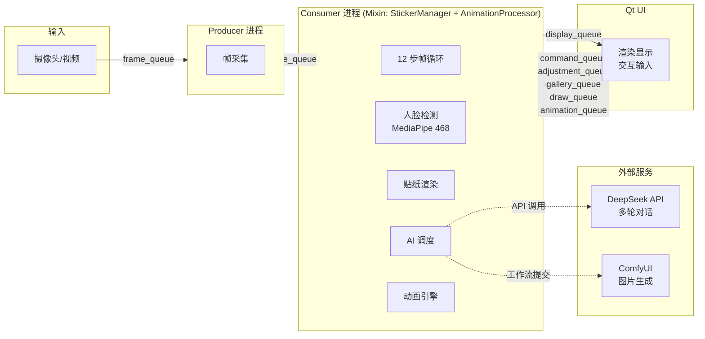
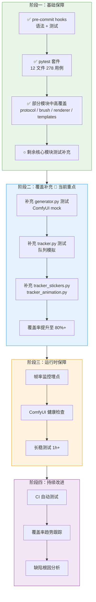
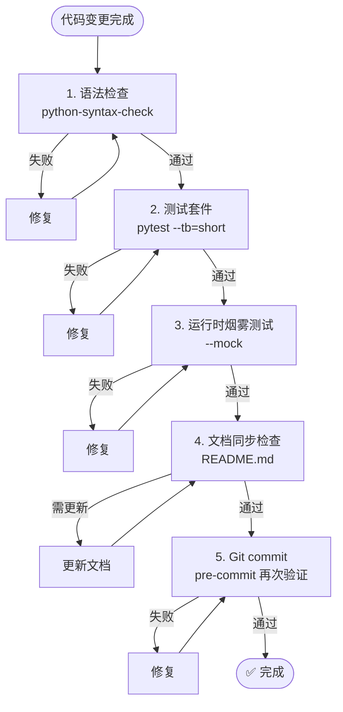
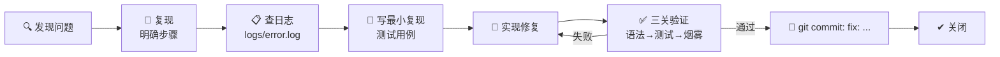
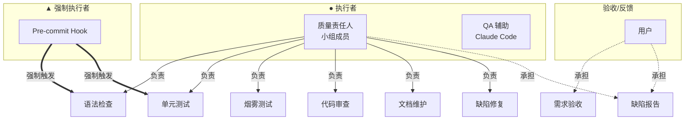
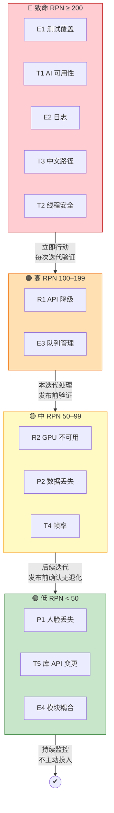

# FaceDoodle 项目质量计划

---

**版本**: v1.0
**生效日期**: 2026-05-21

---

## 1. 项目概述

### 1.1 项目背景

FaceDoodle 是一款 AR 面部贴纸生成与编辑应用。用户通过自然语言描述需求，DeepSeek 多轮对话解析意图，ComfyUI（SDXL + Layer Diffusion）自动生成透明 PNG 贴纸并贴合到人脸上。支持手绘、简笔画 ControlNet 精炼、贴纸关键帧动画、面部直接绘制等功能。

### 1.2 系统架构

Consumer 单帧循环 12 步流水线。7 个多进程队列 + 1 个内部线程队列，所有跨进程消息使用 typed dataclass 定义在 `app/core/protocol.py`。

### 1.3 技术栈

| 层 | 技术 |
|---|------|
| UI | PyQt5 |
| AI 对话 | DeepSeek API（openai 兼容 SDK） |
| AI 图像 | ComfyUI REST API（SDXL + Layer Diffusion + ControlNet Scribble + AnimateDiff） |
| 人脸检测 | MediaPipe 468 关键点模型 |
| 图像处理 | OpenCV、NumPy |
| 进程通信 | Python multiprocessing.Queue |
| 测试 | pytest（12 文件，278 用例） |
| 质量关卡 | pre-commit hooks（语法检查 + 测试套件） |

### 1.4 质量范围

本计划覆盖 FaceDoodle 项目的全部模块：

| 模块 | 路径 | 质量重点 | 当前测试覆盖 |
|------|------|---------|:------------:|
| AI 对话代理 | `app/ai/agent.py` | 意图解析准确率、关键词降级覆盖率 | 中 |
| AI 图像生成 | `app/ai/generator.py` | ComfyUI 超时重试、工作流正确性 | **无** |
| ComfyUI 管理 | `app/ai/comfy_manager.py` | 子进程启动/终止可靠性 | **无** |
| 人脸检测 | `app/core/face_mesh.py` | 检测稳定性、中文路径兼容 | 低 |
| 渲染器 | `app/core/renderer.py` | 贴纸透视变换精度、帧率 | 中 |
| Consumer 主循环 | `app/core/tracker.py` | 队列调度、竞态条件 | **无** |
| 贴纸管理 | `app/core/tracker_stickers.py` | 增删改查正确性 | **无** |
| 动画系统 | `app/core/animation/` | 关键帧插值、导出质量 | 中 |
| 笔刷引擎 | `app/core/brush.py` | 笔迹渲染精度、压感映射 | 高 |
| 面部绘制 | `app/core/face_draw.py` | 坐标变换、撤销栈 | 中 |
| 模板系统 | `app/core/templates.py` | 模板生成完整性 | 中 |
| 协议通信 | `app/core/protocol.py` | 消息类型完整性 | 高 |
| UI | `app/ui/` | 事件处理正确性、跨线程安全 | **无** |
| 配置管理 | `app/utils/config_loader.py` | 配置读/写/合并正确性 | 中 |
| 图像工具 | `app/utils/image_proc.py` | 中文路径兼容、通道处理 | 低 |
| 存储 | `app/utils/storage.py` | 文件完整性、原子写入 | 中 |

### 1.5 质量目标

| 指标 | 目标值 | 测量方式            |
|------|------|-----------------|
| 单元测试覆盖率 | ≥ 80%（核心模块 100%） | pytest-cov      |
| 测试通过率 | 100% | pre-commit hook |
| 语法检查通过率 | 100% | pre-commit hook |
| 运行时启动成功率 | 100% | 烟雾测试            |
| AI 生成成功率 | ≥ 90% | 生成结果统计          |
| AI 关键词降级覆盖率 | 50+ 关键词，12 个面部区域 | `test_agent.py` |
| 渲染帧率 | ≥ 15 FPS（720p） | 运行时监控           |
| 核心路径崩溃率 | 0 | 长时间运  行观测       |
| 已知竞态/死锁 | 0 | 压测              |

### 1.6 适用标准

#### 编码标准

| 标准 | 说明 |
|------|------|
| PEP 8 | Python 风格指南 |
| UTF-8（utf-8-sig） | 源代码编码，含 BOM 用于 Windows |
| ASCII 文件名 | assets PNG 文件（OpenCV 不支持中文路径） |
| Python 3.10+ | 运行环境 |

#### 命名规范

| 对象 | 规范 | 示例 |
|------|------|------|
| 文件 | `snake_case.py` | `face_mesh.py` |
| 类 | `PascalCase` | `ConsumerProcessor` |
| 函数/方法 | `snake_case` / `_leading_underscore` | `_detect_face()` |
| 常量 | `UPPER_SNAKE_CASE` | `PRESSURE_MIN_RATIO` |
| 队列消息 | `Adj`/`Gal`/`Draw`/`Disp`/`Anim`/`Result` 前缀 | `AdjMove` |

#### 架构模式标准

| 模式 | 适用场景 | 强制级别 |
|------|---------|:--------:|
| Typed Dataclass 消息 | 所有跨进程/线程队列通信 | 强制 |
| `np.fromfile + imdecode` | 所有文件图片加载 | 强制 |
| `logging.getLogger(__name__)` | 所有模块日志 | 强制 |
| 深合并配置保存 | `config.json` 写入 | 强制 |
| GenerationState 线程 gating | 共享可变状态 | 强制 |
| Mixin 组合 | Consumer 处理器扩展 | 推荐 |

#### 安全标准

| 标准 | 说明 |
|------|------|
| API Key 不入库 | `api_key.txt` → `.gitignore` |
| 第三方内容隔离 | `assets/gallery/` 用户内容，`assets/temp/` 临时文件 |
| 无命令注入 | Prompt 不拼接 shell 命令 |
| 无 Web/数据库依赖 | 无 XSS、SQL 注入风险 |

---

## 2. 实施策略

### 2.1 质量方针

1. **测试先行**：修改代码后必须运行完整测试套件；无测试覆盖的新增代码须补测试后方可视为完成
2. **三关验证**：每项变更须通过"语法检查 → 测试套件 → 运行时烟雾测试"三道关卡
3. **协议不可变**：跨进程消息一律使用 typed dataclass，禁止裸 dict 传参
4. **日志可追溯**：所有进程使用 `logging` 模块，ERROR 级别落盘（`logs/error.log`，5 MB × 3 轮转）
5. **最小变更**：不引入非需求功能，不为假设场景写处理逻辑，三个相似行好过一个不成熟的抽象

### 2.2 质量保证实施路线

### 2.3 实施原则

1. **增量推进**：每次代码变更顺带为该模块补充 1–2 个测试用例
2. **高风险优先**：RPN ≥ 200 的风险项优先投资源
3. **自动化优先**：能自动化的关卡必须自动化，不依赖人的记忆
4. **文档即时同步**：代码变更后立即更新 README.md

### 2.4 质量控制工具、技术和方法

#### 自动化工具链

| 工具 | 用途 | 触发方式 |
|------|------|---------|
| `scripts/check_syntax.py` | Python 语法编译检查 | pre-commit / 手动 |
| pytest | 278 用例单元/回归测试 | pre-commit / 手动 |
| pre-commit | Git hooks 编排 | 每次 `git commit` |
| `logging` 模块 | 全进程日志 | 运行时自动 |

#### 测试技术

| 技术 | 说明 | 覆盖范围 |
|------|------|---------|
| 单元测试 | pytest + fixtures（`conftest.py`） | 数据模型、算法、工具函数 |
| 集成测试 | Mock 模式端到端流程（`--mock`） | 多进程通信、队列调度 |
| 烟雾测试 | `python app/main.py --mock` 启动验证 | UI 流程、关键路径 |
| 回归测试 | 全量 pytest 每次提交运行 | 所有已覆盖模块 |
| 探索性测试 | 真实模式，真实 ComfyUI | AI 生成、贴纸渲染 |

#### 代码级质量技术

| 技术 | 说明 |
|------|------|
| Typed Dataclass 协议 | 跨进程/线程消息类型化，编译期类型检查 |
| GenerationState 线程 gating | 防 AI 生成并发冲突 |
| 指纹比较 | `_sync_state_to_ui()` 防重复推送 |
| 深合并配置保存 | `_deep_merge()` 防配置覆盖 |
| Mixin 组合 | Consumer 关注点分离 |
| 队列类型化 | 7 条命名队列，每条对应 dataclass Union |

### 2.5 评审流程与标准

#### 触发条件

| 触发条件 | 评审类型 | 执行方式 |
|---------|---------|---------|
| 3+ 文件变更或重构 | 设计评审 | 先写书面计划 → 等待明确批准 → 逐文件实施 |
| 每次代码变更 | 自动化评审 | pre-commit hooks（语法 + 测试） |
| 非平凡变更 | 可执行评审 | `python app/main.py --mock` 烟雾测试 |

#### 评审流程

#### 代码审查标准

- [ ] 无命令注入、中文路径不兼容、线程不安全的反模式
- [ ] 队列消息使用 typed dataclass，未引入裸 dict
- [ ] 无"顺便"引入的非需求功能
- [ ] 没有为不存在的场景添加错误处理、fallback、验证
- [ ] 命名清晰，不写冗余注释

#### 测试审查标准

- [ ] 新增代码有对应测试覆盖
- [ ] 测试断言具体行为，非实现细节
- [ ] 现有 278 用例全部通过，无退化

#### 文档审查标准

- [ ] README.md 功能列表与代码一致
- [ ] 新增配置项在 `config.example.json` 中有对应条目

### 2.6 配置管理要求

#### 版本控制

| 项目 | 要求 |
|------|------|
| VCS | Git |
| 分支策略 | `main` 为主分支 |
| Commit 规范 | 简短中文描述，一行概括做什么、为什么 |
| 禁止 | 修改 git config；`push --force` 到 main；skip hooks |

#### 配置项管理

| 文件 | 版本控制 | 说明 |
|------|:--------:|------|
| `config.json` | 跟踪 | 运行时配置，退出时重写 |
| `config.example.json` | 跟踪 | 模板文件 |
| `api_key.txt` | 不跟踪 | API 密钥（.gitignore） |
| `assets/gallery/index.json` | 不跟踪 | 用户贴纸元数据 |
| `assets/temp/` | 不跟踪 | ComfyUI 临时文件 |

#### 变更控制

- **配置变更**：`_deep_merge()` 保护已有配置，新 key 自动添加
- **依赖变更**：`requirements.txt` 锁定核心依赖，新增需评估兼容性
- **工作流 JSON 变更**：需通过真实 ComfyUI 验证

### 2.7 问题报告和处理系统

#### 严重级别

| 级别 | 定义 | 例子 | 响应时间 |
|:----:|------|------|:--------:|
| **致命** | 应用不可用 | 启动崩溃、AI 生成全部失败 | 立即 |
| **高** | 核心功能受损 | 贴纸丢失、画面冻结 | 24 小时内 |
| **中** | 功能退化 | 特定区域生成失败 | 当前迭代 |
| **低** | 轻微问题 | UI 偏差、边缘情况 | 下个迭代 |

#### 缺陷处理流程

#### 当前已知质量债务

| 债务项 | 风险 ID | RPN | 当前状态 |
|--------|:------:|:---:|---------|
| generator/comfy_manager/tracker 等核心模块无测试 | E1 | 567 | 持续补充中 |
| app/ui/ 全部模块无测试 | E1 | — | 需烟雾测试覆盖 |
| print() 遗留未全部替换为 logging | E2 | 336 | 部分完成 |
| 队列无大小上限 | E3 | 120 | 部分完成 |
| cv2.imread() 中文路径扫描未完成 | T3 | 224 | 70% |
| 渲染分辨率自适应未实现 | T4 | 60 | 未开始 |
| 依赖版本未锁定 | T5 | 14 | 接受风险 |

---

## 3. 项目组织

### 3.1 角色与职责

| 角色 | 人员/系统       | 职责 |
|------|-------------|------|
| **质量责任人** | 小组成员        | 代码编写、测试补充、执行三关验证、缺陷修复、文档维护 |
| **QA 辅助** | Claude Code | 语法检查、测试执行、代码审查、设计审查、文档同步提醒 |
| **自动化守卫** | pre-commit hooks | 每次 git commit 强制执行语法检查 + 测试套件 |
| **隐式验收者** | 用户          | 使用反馈、缺陷发现 |

### 3.2 责任矩阵

| 活动 | 质量责任人 | QA 辅助 | Pre-commit | 用户 |
|------|:---------:|:------:|:----------:|:---:|
| 语法检查 | ● | ● | ▲ | |
| 单元测试 | ● | ● | ▲ | |
| 烟雾测试 | ● | ● | | |
| 代码审查 | ● | ● | | |
| 文档维护 | ● | ● | | |
| 缺陷修复 | ● | ● | | |
| 需求验收 | | | | ● |
| 缺陷报告 | ● | | ● | ● |

● = 执行者　　▲ = 强制执行者

### 3.3 文档维护责任

| 文档 | 责任人 | 更新时机 |
|------|:------:|---------|
| CLAUDE.md | 质量责任人 | 每次重大变更后 |
| README.md | 质量责任人 | 功能新增/移除后 |
| RISK_MANAGEMENT_PLAN | 质量责任人 | 每迭代结束 |
| QUALITY_PLAN.md | 质量责任人 | 每迭代或重大变更后 |
| config.example.json | 质量责任人 | 配置项变更时 |

### 3.4 关键文档要求

| 文档 | 要求 |
|------|------|
| README.md | 与代码同步：功能列表、快捷键、配置项。不得保留已移除的功能描述 |
| RISK_MANAGEMENT_PLAN | 每迭代更新 RPN 和处理状态，反映最新风险形势 |
| config.example.json | 与 `config.json` key 一致，不包含真实密钥 |
| 代码注释 | 不写 WHAT，只写 WHY（非显而易见的约束、workaround、会令人意外的行为） |

---

## 4. 质量保证对象分析及选择

### 4.1 风险与质量保证对象映射

基于 `docs/RISK_MANAGEMENT_PLAN.md` 中的 FMEA 分析，按 RPN（Risk Priority Number = 严重度 × 发生度 × 可探测度）确定优先级。

| 风险 ID | 失效模式 | S | O | D | RPN | Q 保证对象 | Q 措施 |
|:------:|---------|:---:|:---:|:---:|:---:|-----------|--------|
| E1 | 代码修改引入回归 | 7 | 9 | 9 | **567** | 全量测试套件 | 每次提交强制 pytest |
| T1 | ComfyUI 无响应 | 9 | 7 | 6 | **378** | generator.py | 超时重试 + 健康检查 + mock 降级 |
| E2 | 故障无法定位 | 6 | 7 | 8 | **336** | 日志系统 | 全模块 logging + ERROR 落盘 |
| T2 | 线程竞态崩溃 | 9 | 4 | 7 | **252** | tracker.py | GenerationState 加锁 + 类型化 |
| T3 | 中文路径加载失败 | 8 | 7 | 4 | **224** | image_proc.py | 统一 `np.fromfile+imdecode` |
| R1 | API Key 不可用 | 9 | 4 | 5 | **180** | agent.py | 关键词降级 + 连通检查 |
| E3 | 队列满/僵死 | 10 | 2 | 6 | **120** | protocol.py | 队列上限 + 满载丢非关键帧 |
| R2 | GPU 不可用 | 8 | 4 | 3 | **96** | generator.py | CPU-only / mock 模式引导 |
| P2 | 贴纸数据丢失 | 8 | 2 | 5 | **80** | storage.py | UUID 命名 + 原子写入 |
| T4 | 帧率下降 | 5 | 4 | 3 | **60** | renderer.py | 跳帧 + 自适应分辨率 |
| P1 | 人脸短暂丢失 | 4 | 6 | 2 | **48** | face_mesh.py | 5 帧缓存（已实现） |
| E4 | 模块耦合 | 3 | 5 | 2 | **30** | tracker.py | Mixin 拆分 + 协议隔离 |
| T5 | 库 API 变更 | 7 | 1 | 2 | **14** | requirements.txt | 锁定版本，接受风险 |

### 4.2 优先级分层

---

## 5. 质量保证任务划分

### 5.1 按阶段划分

#### 开发阶段（每次代码变更）

| 任务 | 频率 | 工具 | 执行者 |
|------|------|------|:------:|
| Python 语法检查 | 每次提交前 | `scripts/check_syntax.py` | 责任人 + pre-commit |
| 单元测试 | 每次提交前 | `pytest tests/ -v` | 责任人 + pre-commit |
| 运行时烟雾测试 | 非平凡变更后 | `python app/main.py --mock` | 责任人 |
| 代码自审 | 3+ 文件变更前 | CLAUDE.md 工作流 | 责任人 |

#### 迭代阶段（功能完成时）

| 任务 | 频率 | 工具 | 执行者 |
|------|------|------|:------:|
| 全量测试 | 每功能完成 | `pytest tests/ -v` | 责任人 |
| Mock 模式全流程 | 每功能完成 | `python app/main.py --mock` | 责任人 |
| 真实模式 AI 生成测试 | AI 相关变更 | `python app/main.py` | 责任人 |
| README 同步更新 | 每功能完成 | 手动 | 责任人 |
| 端到端工作流验证 | 每功能完成 | 手动 | 责任人 |

#### 发布阶段

| 任务 | 工具 | 执行者 |
|------|------|:------:|
| 完整测试（含详细回溯） | `pytest tests/ -v --tb=long` | 责任人 |
| 测试覆盖率报告 | `pytest --cov=app tests/ --cov-report=term` | 责任人 |
| 中文路径兼容测试 | 含中文路径的测试用例 | 责任人 |
| 依赖锁定检查 | `pip freeze` vs `requirements.txt` | 责任人 |
| 配置兼容检查 | `config.example.json` vs `config.json` | 责任人 |

### 5.2 按模块划分

| 模块 | 测试文件大小 | 覆盖水平 | 状态 |
|------|:----------:|:--------:|:----:|
| `app/core/protocol.py` | 11.7 KB | 高 | OK |
| `app/core/brush.py` | 9.7 KB | 高 | OK |
| `app/core/animation/` | 7.9 + 4.5 KB | 中 | OK |
| `app/core/renderer.py` | 7.8 KB | 中 | OK |
| `app/utils/storage.py` | 6.9 KB | 中 | OK |
| `app/utils/config_loader.py` | 5.8 KB | 中 | OK |
| `app/ai/agent.py` | 5.2 KB | 中 | OK |
| `app/core/face_draw.py` | 5.0 KB | 中 | OK |
| `app/core/templates.py` | 2.8 KB | 中 | OK |
| `app/ai/generator.py` | — | **无** | 待补充 |
| `app/ai/comfy_manager.py` | — | **无** | 待补充 |
| `app/core/tracker.py` | — | **无** | 待补充 |
| `app/core/tracker_stickers.py` | — | **无** | 待补充 |
| `app/core/tracker_animation.py` | — | **无** | 待补充 |
| `app/ui/*` | — | **无** | 待补充 |
| `app/main.py` | — | **无** | 待补充 |

---

## 6. 实施计划

### 6.1 阶段一：基础保障（进行中）

| 事项 | 状态 | 说明 |
|------|:----:|------|
| pre-commit hooks 部署 | ✅ | 语法检查 + pytest 自动运行 |
| pytest 套件（278 用例） | ✅ | 12 文件，全部通过 |
| 部分模块中高覆盖 | ✅ | protocol / brush / renderer / templates / storage / config_loader |
| 日志系统 | ✅ | `logging` 全模块 + ERROR 落盘 + 轮转 |
| 线程 gating | ✅ | `GenerationState` 锁机制 |

### 6.2 阶段二：覆盖补充（当前重点，计划 2 周）

| 事项 | 优先级 | 方法 |
|------|:------:|------|
| 补充 `generator.py` 测试 | P0 | Mock ComfyUI HTTP 响应 |
| 补充 `tracker.py` 测试 | P0 | 模拟队列输入/输出 |
| 补充 `tracker_stickers.py` 测试 | P1 | 状态机测试 |
| 补充 `tracker_animation.py` 测试 | P1 | 动画片段评估测试 |
| 补充 `comfy_manager.py` 测试 | P2 | 子进程 mock |
| 提升覆盖率至 80%+ | P0 | 整体评估 |

### 6.3 阶段三：运行时保障（计划 1 周）

| 事项 | 优先级 | 方法 |
|------|:------:|------|
| 帧率监控埋点 | P1 | 在 `_render_frame()` 中计时上报 |
| ComfyUI 健康检查自动化 | P1 | 启动时 / 定期 ping `/api/queue` |
| Mock 模式长稳测试（1h+） | P2 | 自动化循环脚本 |
| 队列满载测试 | P2 | 极限帧率输入 |

### 6.4 阶段四：持续改进（长期）

| 事项 | 优先级 | 方法 |
|------|:------:|------|
| CI 自动运行测试 | P2 | GitHub Actions / 本地 CI |
| 测试覆盖率趋势跟踪 | P3 | 定期记录覆盖率数字 |
| 缺陷根因分析 | P2 | 每个 bug 补一个防御测试 |
| 代码复杂度监控 | P3 | 人工感知（单函数 ≤ 50 行，单类 ≤ 500 行） |

---

## 7. 资源计划

### 7.1 人力资源

| 角色 | 人员               | 时间投入 |
|------|------------------|---------|
| 质量责任人（开发 + QA） | 小组成员             | 全部开发时间 |
| 自动化 QA | Pre-commit hooks | 每次 commit（秒级） |
| QA 辅助 | Claude Code      | 按需调用 |

### 7.2 环境资源

| 资源 | 用途 | 要求 |
|------|------|------|
| Python 3.10+ | 开发 + 测试 | 含 pytest、pre-commit |
| ComfyUI 本地实例 | AI 生成集成测试 | GPU（推荐）或 CPU |
| DeepSeek API | AI 对话集成测试 | 有效 API Key |
| 摄像头 | 真实模式测试 | 系统默认摄像头 |
| 视频文件 | 视频模式测试 | `test_data/face_test.mp4` |

### 7.3 工具资源

| 工具 | 许可 | 用途 |
|------|------|------|
| pytest | MIT | 测试框架 |
| pre-commit | MIT | Git hooks 管理 |
| OpenCV | Apache 2.0 | 图像处理 |
| MediaPipe | Apache 2.0 | 人脸检测 |
| PyQt5 | GPL | UI 框架 |
| openai (Python SDK) | Apache 2.0 | DeepSeek API 调用 |

---

## 8. 记录的收集、维护与保存

### 8.1 记录类型与保存策略

| 记录类型 | 位置 | 保存期限 | 清理策略 |
|---------|------|:--------:|---------|
| 测试执行结果 | stdout | 会话期 | 不持久化 |
| 错误日志 | `logs/error.log` | 永久（轮转） | 5 MB × 3 轮转 |
| 应用配置 | `config.json` | 永久 | 退出时重写 |
| 用户贴纸 | `assets/gallery/` | 永久 | 用户手动管理 |
| ComfyUI 临时文件 | `assets/temp/` | 短期 | ≤ 50 文件，超出清理旧文件 |
| Git 历史 | `.git/` | 永久 | `git gc` 按需 |
| Commit 记录 | Git log | 永久 | 不 squash/amend 已推送提交 |
| 风险管理状态 | `docs/RISK_MANAGEMENT_PLAN.md` | 永久（版本跟踪） | 每迭代更新 |
| 质量计划 | `docs/QUALITY_PLAN.md` | 永久（版本跟踪） | 每迭代或重大变更后 |

### 8.2 记录访问方式

| 记录 | 查看方式 |
|------|---------|
| 错误日志 | 文本编辑器打开 `logs/error.log` |
| 测试结果 | `pytest tests/ -v --tb=long` |
| 代码变更历史 | `git log --oneline` / `git diff` |
| 风险/质量状态 | 阅读 `docs/RISK_MANAGEMENT_PLAN.md` / `docs/QUALITY_PLAN.md` |
| 配置状态 | 阅读 `config.json`，或通过代码查询 |

### 8.3 收集时机

| 时机 | 收集内容 |
|------|---------|
| 每次 `git commit` | pre-commit 输出（语法 + 测试结果） |
| 每次应用启动 | 启动日志（INFO+）写入 console |
| 应用运行中 | WARNING+ 写入 `logs/error.log` |
| 每次功能完成 | README.md / CLAUDE.md 更新对账 |
| 每次迭代结束 | 风险管理 RPN + 状态更新，质量计划进度更新 |

### 8.4 记录管理纪律

1. 测试结果的异常需立即修复，不等下个迭代
2. 错误日志中出现 WARNING 以上条目需追溯原因
3. 文档更新与代码变更在同一 commit 中提交
4. 临时文件定期检查，不超过 50 阈值
5. Git 历史不留临时调试日志或注释掉的代码

---

## 附录：术语表

| 术语 | 全称/说明 |
|------|---------|
| RPN | Risk Priority Number = 严重度(S) × 发生度(O) × 可探测度(D) |
| FMEA | Failure Mode and Effects Analysis，失效模式与影响分析 |
| RBS | Risk Breakdown Structure，风险分解结构 |
| Mock 模式 | 跳过 ComfyUI，使用缓存图片测试 UI（`--mock`） |
| ComfyUI | Stable Diffusion 工作流编排后端 |
| SDXL | Stable Diffusion XL |
| Layer Diffusion | 透明背景扩散模型扩展 |
| ControlNet Scribble | 简笔画条件控制模块 |
| AnimateDiff | 文本驱动的视频/动画扩散模型 |
