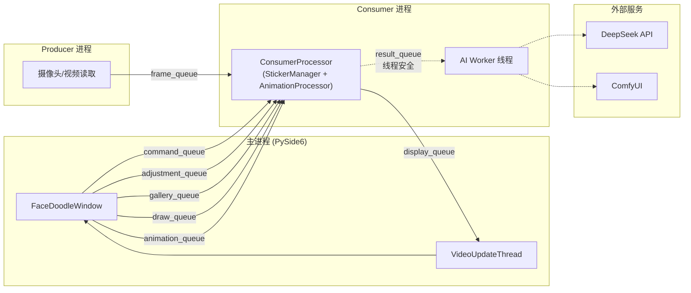
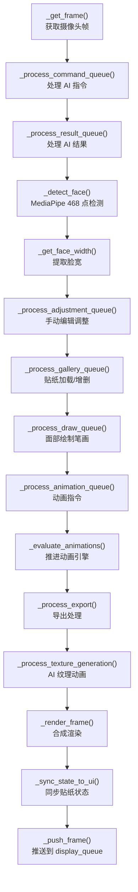
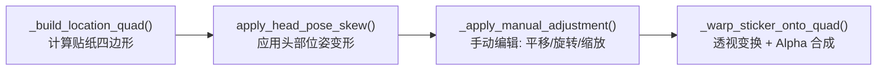
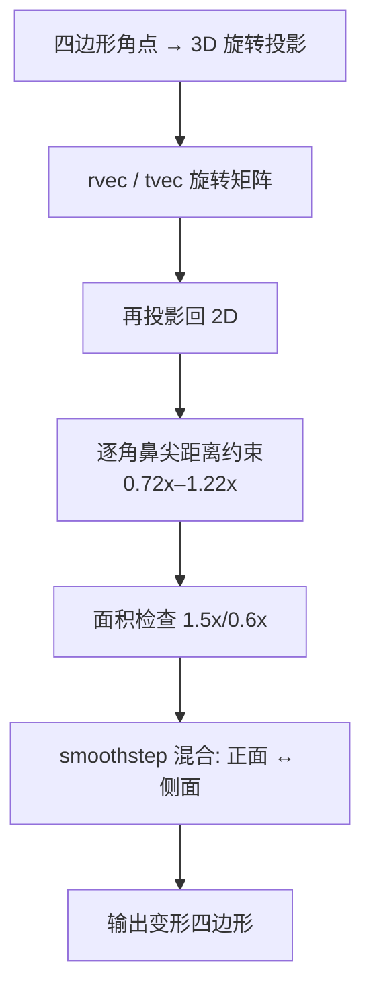
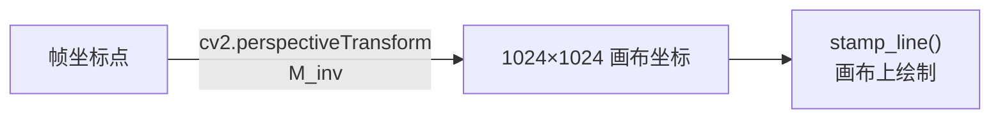
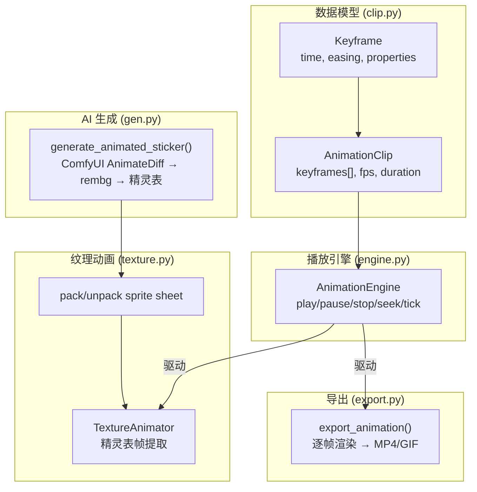
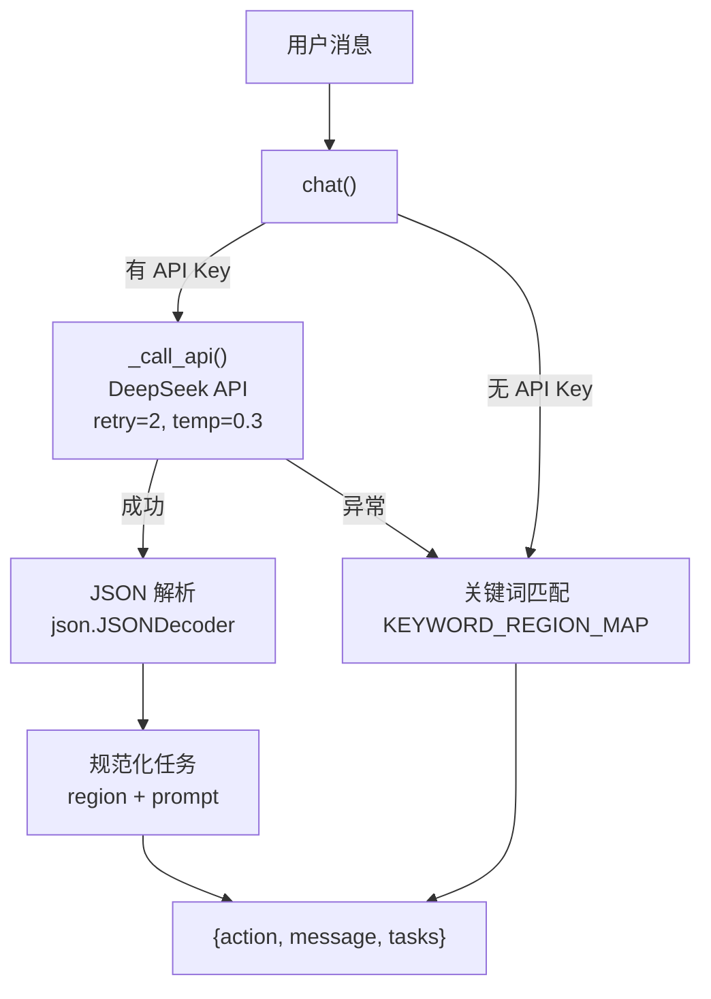
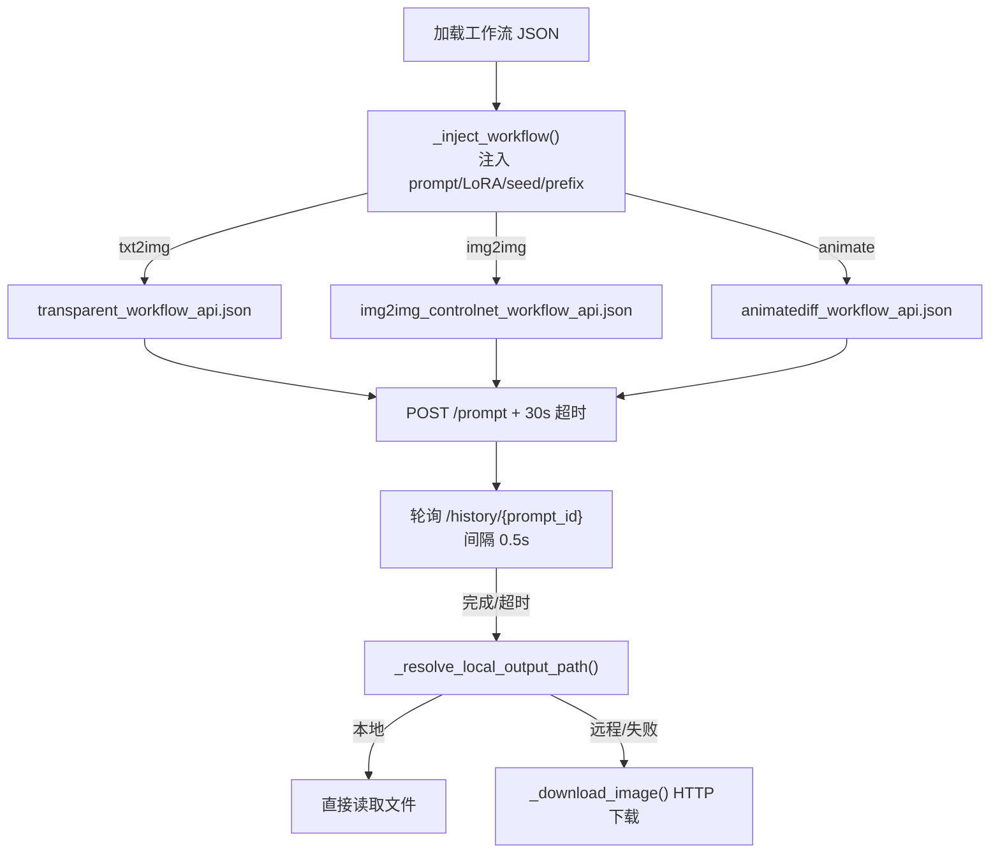
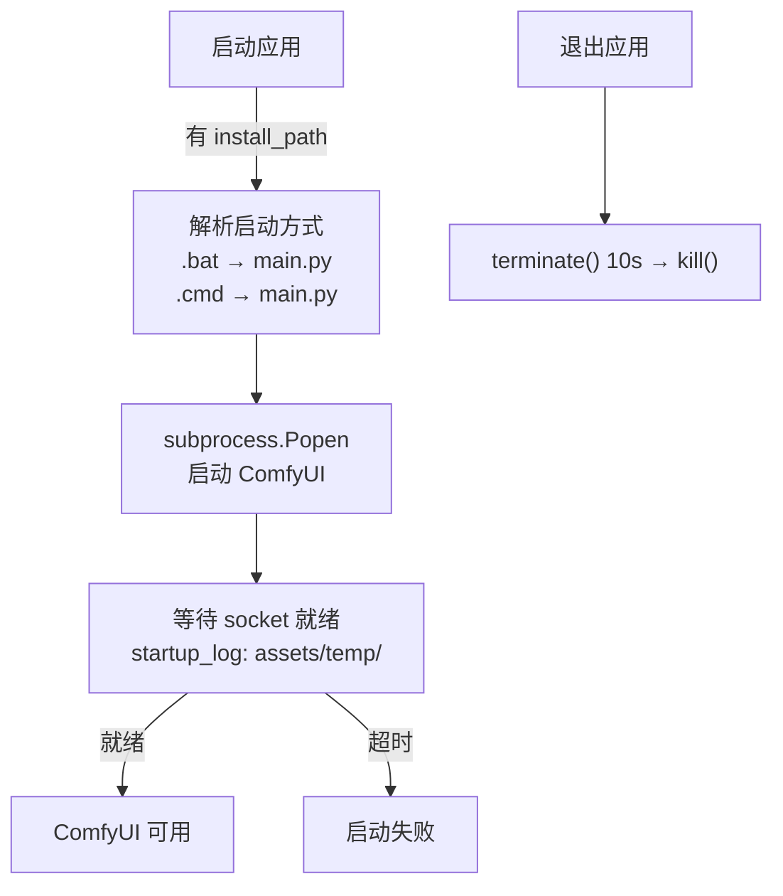

# FaceDoodle 技术实现报告

---

**版本**: v1.1
**日期**: 2026-05-31

---

## 1. 项目概述

### 1.1 项目简介

FaceDoodle 是一款 AR 面部贴纸生成与编辑桌面应用。用户通过自然语言描述需求，DeepSeek 多轮对话解析意图，ComfyUI（SDXL + Layer Diffusion）自动生成透明 PNG 贴纸并贴合到人脸上。支持手绘、简笔画 ControlNet 精炼、关键帧动画、面部直接绘制等功能。

### 1.2 技术栈

| 层 | 技术 | 用途 |
|---|------|------|
| 运行时 | Python 3.10+ | 主语言 |
| 桌面 UI | PySide6 | 主窗口、事件处理、画廊、时间轴 |
| 人脸检测 | MediaPipe | 468 关键点 FaceMesh 模型 |
| 图像处理 | OpenCV + NumPy | 透视变换、贴纸合成、图像 I/O |
| AI 对话 | DeepSeek API (openai SDK) | 多轮对话意图解析 |
| AI 图像 | ComfyUI REST API | SDXL + Layer Diffusion + ControlNet + AnimateDiff |
| 进程通信 | Python multiprocessing.Queue | 8 条队列 |
| 测试 | pytest | 18 文件，401 用例 |
| 版本控制 | Git + pre-commit hooks | 语法检查 + 自动化测试 |

### 1.3 代码规模

| 模块 | 文件数 | 代码行数 |
|------|:------:|:--------:|
| `app/ai/` | 3 | 970 |
| `app/core/` | 11 | 3,860 |
| `app/core/animation/` | 6 | 669 |
| `app/ui/` | 9 | 4,950 |
| `app/utils/` | 4 | 760 |
| `app/main.py` | 1 | 220 |
| `tests/` | 18 | — |
| **总计** | **51** | **~14,639** |

---

## 2. 系统架构

### 2.1 进程架构



### 2.2 队列通信表

| 队列 | 方向 | 消息类型 | 用途 |
|------|------|---------|------|
| `frame_queue` | Producer → Consumer | `np.ndarray` | 原始摄像头帧 |
| `display_queue` | Consumer → UI | `ndarray` / `Disp*` dataclass | 渲染帧 + 状态消息 |
| `command_queue` | UI → Consumer | `str` / `CmdImg2Img` | AI 生成指令 |
| `adjustment_queue` | UI → Consumer | `Adj*` dataclass (4 种) | 贴纸移动/旋转/缩放/重置 |
| `gallery_queue` | UI → Consumer | `Gal*` dataclass (6 种) | 贴纸/模板加载与管理 |
| `draw_queue` | UI → Consumer | `Draw*` dataclass (14 种) | 面部绘制操作 |
| `animation_queue` | UI → Consumer | `Anim*` dataclass (15 种) | 动画播放/关键帧/导出/纹理生成 |
| `result_queue` | AI 线程 → Consumer | `Result*` dataclass (5 种) | AI 生成进度/结果/错误 |

所有消息均为 `app/core/protocol.py` 中定义的 typed dataclass，禁止裸 dict 传递。

### 2.3 ConsumerProcessor 主循环



ConsumerProcessor 采用 Mixin 组合：

```python
class ConsumerProcessor(StickerManager, AnimationProcessor):
    ...
```

- `StickerManager` (tracker_stickers.py)：贴纸增删改查、模板加载、分组管理
- `AnimationProcessor` (tracker_animation.py)：动画队列分发、片段评估、导出/纹理生成调度

---

## 3. 核心模块实现

### 3.1 协议通信（protocol.py）

#### 设计原则

- 所有跨进程/跨线程消息使用 typed dataclass
- 每种消息有默认值，便于构造
- 消费端通过 `isinstance()` 分发，替代字符串 `msg["action"]` 模式
- 6 个 Action 常量类：`Adj`(4), `Gal`(6), `Draw`(14), `Result`(5), `Disp`(6), `Anim`(15)

#### 消息分发模式

```python
def _process_result_queue(self):
    msg = self.result_queue.get_nowait()
    if isinstance(msg, ResultGenerationProgress):
        ...
    elif isinstance(msg, ResultGenerationResult):
        ...
    elif isinstance(msg, ResultGenerationDone):
        ...
    elif isinstance(msg, ResultAgentQuestion):
        ...
    elif isinstance(msg, ResultError):
        ...
```

### 3.2 人脸检测（face_mesh.py）

**FaceDetector 类**：

| 参数 | 值 |
|------|-----|
| 模型 | MediaPipe FaceMesh |
| 关键点数 | 468 |
| 检测置信度 | 0.4 |
| 跟踪置信度 | 0.4 |
| 丢失容忍帧数 | 5 帧（之后清除缓存） |

**输出结构**：
- `landmarks`：468 × 3 的归一化坐标数组 (x, y, z)
- `landmark_rects`：12 个面部区域的边界框字典（`forehead_top`, `eyes`, `nose`, `mouth`, `head_top`, `cheek_left`, `cheek_right`, `brows`, `forehead_full`, `chin`, `left_eye`, `right_eye`, `full_face`）
- `face_width`：脸宽归一化值
- `rvec` / `tvec`：由 solvePnP 解算的头部位姿（用于 3D 透视变形）

**实现要点**：
- 单帧检测，失败时装填上一帧缓存（≤ 5 帧）
- 脸宽基于左右脸颊（landmark 234/454）距离
- 眼部中心用于计算脸部朝向角度

### 3.3 贴纸渲染（renderer.py）

#### 透视贴合流水线



#### 四边形构建（_build_location_quad）

- 根据贴纸绑定的面部区域 `region`，从 `landmark_rects` 获取基准矩形
- 以眼部连线为 X 轴方向，计算正交坐标系
- 根据贴纸宽高比缩放四边形（保持贴纸原有比例）
- 返回 4 个角点坐标 `(x, y)`

#### 头部位姿变形（apply_head_pose_skew）

双层策略，优先 3D 方法：

**方法一：solvePnP 3D 投影（含鼻尖距离约束）**



- 使用 `face_mesh.py` 中 solvePnP 解算的 `rvec`/`tvec`/`camera_matrix`
- 将四边形角点投影到 3D、应用头部旋转、再投影回 2D
- **逐角鼻尖距离约束**（灵感来自 ar-facedoodle）：以鼻尖为稳定 3D 参考点，保留 solvePnP 旋转方向，钳位角点距鼻尖的变化在 0.72x–1.22x
- 面积检查（1.5x/0.6x）兜底，smoothstep 平滑过渡

**方法二：2D 启发式（降级方案，含同等距离约束）**

- 根据左右脸颊到鼻子的距离计算 `yaw_ratio`
- 根据额头/下巴距离计算 `pitch_ratio`
- 远侧水平压缩，近侧拉伸 + 全局位移
- 同样施加鼻尖距离约束（0.72x–1.22x）

**设计缘由**：ar-facedoodle 将 3D 面片顶点直接置于 MediaPipe 3D 坐标，每个贴纸平面跟随其局部的三角面片重心 + 法向量，由 GPU 透视相机一次投影。FaceDoodle 的 2D 四边形构建自相机已透视的 2D 地标，solvePnP 叠加"二次透视"导致远侧角点异常放大（"歪头贴纸放大" bug）。新方案保留 solvePnP 的旋转方向，用 2D 地标到鼻尖的原始距离作为缩放真值来钳位幅度。

#### 透视贴合（_warp_sticker_onto_quad）

- `cv2.getPerspectiveTransform()` 计算源→目标映射
- 目标四边形包围盒裁剪以优化计算
- `cv2.warpPerspective()` + `BORDER_CONSTANT` 透明填充
- Alpha 合成：`result = sticker_rgb * alpha + frame * (1 - alpha)`

#### 多贴纸合并（composite_stickers_to_merged）

- **第一遍**：将所有贴纸投影到共享画布，计算包围盒，扩展为 full_face 比例
- **第二遍**：依次透视变换 + Alpha 合成到合并画布
- 返回合并图像 + 定位参数，作为复合贴纸贴回脸部

### 3.4 笔刷系统（brush.py）

#### 笔刷尖端缓存

```python
_tip_cache: dict[tuple[str, int], np.ndarray] = {}
# key = (tip_filename, size)
```

- `load_brush_tip(tip_filename, size)` 按需加载
- 支持 2/3/4 通道 PNG，统一转为 BGRA
- 尺寸 = `(size * 2 + 1) × (size * 2 + 1)`

#### 图章算法（stamp_brush）

```python
def stamp_brush(canvas, cx, cy, tip, color, opacity, is_eraser):
    # 1. 计算 ROI 交集
    # 2. 画笔模式: composite = color * tip_alpha
    #    alpha = max(existing_alpha, brush_alpha)
    # 3. 橡皮模式: roi_alpha *= (1 - tip_alpha)
```

#### 线段图章（stamp_line）

- 沿线段以 `spacing_px` 间隔采样
- 每点叠加高斯抖动 `np.random.normal(0, scatter)`

#### 数位板压感

| 参数 | 值 |
|------|-----|
| 最小比例 | `PRESSURE_MIN_RATIO = 0.2` |
| 模式 | `none` / `size` / `opacity` / `both` |

`QTabletEvent` 提供 `event.pressure()` (0.0–1.0)，`_tablet_in_use` 标志抑制鼠标事件。

### 3.5 面部绘制（face_draw.py）

#### 逆透视映射



- 画布大小：`CANVAS_SIZE = 1024`
- `begin_stroke(face_quad)`：接收面部四边形，计算逆透视变换矩阵
  - `cv2.getPerspectiveTransform(face_quad → [(0,0), (511,0), (511,511), (0,511)])`
- `add_stroke_point(pt)`：帧坐标 → 画布坐标 → 画笔图章
- `get_result()`：裁剪透明边界 + 10px 边距

**关键设计**：绘制在规范化的 1024×1024 空间中进行，渲染时由 `renderer.py` 通过正向透视变换贴回脸部。

#### 撤销系统

- `MAX_UNDO = 20`（FIFO 淘汰）
- `_push_undo()` 在每次笔画开始时复制当前画布

### 3.6 动画系统（animation/）



#### 关键帧模型（clip.py）

| 属性 | 说明 |
|------|------|
| `AnimationClip.name` | 片段名称 |
| `AnimationClip.keyframes` | `list[Keyframe]` |
| `Keyframe.time` | 时间点（秒） |
| `Keyframe.properties` | `dict[str, float]`（offset_x, offset_y, rotation, scale_mult） |
| `Keyframe.easing` | `linear` / `ease-in` / `ease-out` / `ease-in-out` |

插值算法 (`evaluate_clip`)：
- 定位 `t` 所在的关键帧区间
- 应用缓动函数计算插值因子
- 线性插值每个属性值
- 支持循环 (`loop 模式`) 和前/后填充

#### 播放引擎（engine.py）

```
tick(delta_seconds)
  → 推进 current_time
  → evaluate_clip() 获取当前帧属性
  → 与手动编辑合并（动画属性叠加到手动属性上）
```

#### AI 纹理动画管线（gen.py）⚠️ 开发中

> **状态**：AnimateDiff 工作流在当前 ComfyUI 环境下未稳定产出一致帧序列，该功能标记为开发中，UI 入口暂时不可用。关键帧手动动画和 GIF/MP4 导出功能正常。

```
贴纸预处理 (1024×1024 白色画布)
  → ComfyUI AnimateDiff (animatediff_workflow_api.json)
  → rembg 逐帧去背景
  → 统一尺寸
  → pack_frames_to_sprite_sheet()
```

精灵表布局：`compute_grid(frame_count)` → 近正方形网格（16帧→4×4，10帧→4×3）

#### 导出（export.py）

- MP4：OpenCV `VideoWriter`（`avc1` / `mp4v` fourcc）
- GIF：imageio `mimsave()`
- 默认分辨率：640×480

---

## 4. AI 集成实现

### 4.1 对话代理（agent.py）

#### 架构



#### API 调用参数

| 参数 | 值 |
|------|-----|
| 端点 | `https://api.deepseek.com` |
| 模型 | `deepseek-chat`（可配置） |
| 温度 | 0.3 |
| 响应格式 | `{"type": "json_object"}` |
| 重试 | 2 次，指数退避 `1.0 × 2^attempt` 秒 |
| System Prompt | 98 行，定义 12 个面部区域和输出格式 |

#### 关键词降级

`KEYWORD_REGION_MAP`：**9 个面部区域**，60 个关键词条目：

| 区域 | 示例关键词 |
|------|-----------|
| `head_top` | 猫耳、兔耳、耳朵、帽子、皇冠、光环、王冠、犄角 |
| `forehead_top` | 触角、发箍、头箍 |
| `forehead_full` | 发饰、头饰、发带、蝴蝶结、头巾、角 |
| `eyes` | 眼镜、墨镜、眼罩、眼影、眼线、睫毛、护目镜、太阳镜、美瞳 |
| `brows` | 眉毛 |
| `nose` | 鼻子、猪鼻、小丑鼻、红鼻子、狗鼻、猫鼻 |
| `mouth` | 胡子、口罩、嘴唇、口红、牙齿、舌头、獠牙、虎牙、龅牙 |
| `cheek_left` | 腮红、面纹、伤疤、雀斑、脸红、纹身、刀疤、爱心、星星 |
| `cheek_right` | 右脸、右侧脸颊、右颊 |

`REGION_ALIASES` 映射 17 个中英文别名到规范区域名。

### 4.2 ComfyUI 客户端（generator.py）

#### 工作流提交



#### 工作流注入细节

- 定位节点：通过 `_meta.title` 匹配（`"CLIP Text Encode (Prompt)"` 等）
- Prompt 注入：替换 `inputs.text`
- LoRA 切换：有 LoRA → 通过 Loader 节点；无 LoRA → 直连 Checkpoint
- 图片上传：img2img/ControlNet 时先 POST `/upload/image`
- 节点发现：`_score_output_node()` 评分函数，优先选择 `JoinImageWithAlpha` 上游节点（透明输出）

#### 超时与重试

| 操作 | 超时 | 重试 |
|------|:----:|:----:|
| 提交 POST | 30s | 0 |
| 生成轮询 | 120s（可配置） | 0（单次长连接） |
| AnimateDiff 轮询 | 300s | 0 |

#### 中文路径兼容

- Prompt 文字提取 ASCII 片段作为文件名前缀（`_make_slug()`）
- 纯中文/emoji prompt 回退到随机 hex 前缀
- 输出路径多候选目录查找（环境变量 → CWD → 用户目录）
- 文件系统快照 diff 作为最后手段（`_find_new_temp_file()`）

#### 临时文件管理

- 位置：`assets/temp/`
- 清理：`cleanup_temp_files()` 保留最新的 50 个文件

### 4.3 ComfyUI 自动管理（comfy_manager.py）



---

## 5. 关键技术决策

### 5.1 为什么用 Mixin 组合而非继承链

```python
# 采用
class ConsumerProcessor(StickerManager, AnimationProcessor):
    ...

# 而非
class ConsumerProcessor(AnimationProcessor):
    ...
class AnimationProcessor(StickerManager):
    ...
```

**原因**：
- 贴纸管理和动画处理是正交关注点，不应有继承关系
- Consumer 主循环可以独立演进，mixin 只提供方法注入
- 新增能力只需添加 mixin，不改变现有类层次

### 5.2 为什么用 typed dataclass 而非 dict

**问题**：多进程传递裸 dict，消费端靠字符串匹配分发，类型不安全、拼写错误难发现、discovery 困难。

**方案**：`app/core/protocol.py` 统一定义所有消息为 dataclass：

```python
@dataclass
class AdjMove:
    action: str = "move"
    delta_x: float = 0.0
    delta_y: float = 0.0

# 消费端
if isinstance(msg, AdjMove):
    _handle_move(msg.delta_x, msg.delta_y)
```

**收益**：编译期类型检查、IDE 自动补全、单一真相源、消息格式自文档化。

### 5.3 为什么用逆透视变换做面部绘制

**问题**：直接在摄像头帧上画线，线条不跟随脸部变形。脸部转动后之前画的线会"浮"在空气中。

**方案**：
1. 获取当前面部四边形（4 个角点）
2. 计算逆透视变换矩阵（面四边形 → 1024×1024 正方形）
3. 将帧坐标变换到规范画布空间绘制
4. 渲染时正向透视变换贴回面部

**收益**：绘制内容始终紧密贴合面部几何，转头时线条随脸部自然变形。

### 5.4 OpenCV 中文路径解决方案

**问题**：Windows 下 `cv2.imread()` 不支持含中文的路径。

**方案**：全项目统一使用 `np.fromfile + imdecode`：

```python
raw = np.fromfile(path, dtype=np.uint8)
image = cv2.imdecode(raw, cv2.IMREAD_UNCHANGED)
```

**范围**：`image_proc.py`、`storage.py`、`brush.py`、`generator.py`、`templates.py` 所有涉及文件 I/O 的位置。

### 5.5 AI 生成线程安全

**问题**：AI 生成为异步操作（spawn 线程），可能多个生成请求并发。

**方案**：`GenerationState` 类作为线程安全门控：

```python
class GenerationState:
    def __init__(self):
        self._lock = threading.Lock()
        self._generating = False

    def start(self):
        with self._lock:
            if self._generating: return False
            self._generating = True
            return True
```

消费端在 `_process_command_queue()` 中检查 `gen_state.is_generating`，True 时跳过新指令。

---

## 6. 数据持久化

### 6.1 贴纸存储（storage.py）

| 项目 | 说明 |
|------|------|
| 图片命名 | `{UUID}.png` |
| 缩略图 | `{UUID}_thumb.png`（120×120） |
| 存储目录 | `assets/gallery/` |
| 索引文件 | `assets/gallery/index.json` |
| 线程安全 | `threading.Lock()` 保护索引写 |

#### 索引结构

```json
{
  "stickers": [{
    "id": "uuid",
    "prompt": "生成提示词",
    "region": "forehead_top",
    "scale": 1.0,
    "image": "uuid.png",
    "thumb": "uuid_thumb.png",
    "created_at": "ISO8601",
    "favorite": false,
    "offset_x": 0.0, "offset_y": 0.0,
    "rotation": 0.0, "scale_mult": 1.0
  }],
  "groups": [{
    "id": "uuid",
    "name": "组名",
    "member_ids": ["uuid1", "uuid2"]
  }]
}
```

#### 动画贴纸扩展

- 精灵表存储为单张 PNG
- 元数据标记 `is_animated: true`，记录 `frame_count`、`frame_cols`、`frame_rows`、`fps`、`motion_prompt`
- 缩略图使用第一帧

### 6.2 配置管理（config_loader.py）

#### 配置优先级

```
环境变量 DEEPSEEK_API_KEY > api_key.txt > config.json api_key
```

#### 配置保存

- `save_config()` 使用 `_deep_merge()`：递归合并 dict，非 dict 值整体替换
- 写入前比较：值未变不写文件
- 自动剥离 Python 对象，保持 JSON 可移植

#### 风格预设

4 个内置预设（`is_builtin_preset`）：`pixel_art`、`vector_art`、`cartoon_style`、`semi_realistic`

Prompt 构建：`build_styled_prompt(user_text, preset) → 包装后的 prompt + LoRA 配置`

---

## 7. 测试体系

### 7.1 测试套件概况

| 测试文件 | 覆盖模块 |
|---------|---------|
| `test_protocol.py` | 协议消息类型检查 |
| `test_brush.py` | 笔刷加载、图章、线段 |
| `test_animation.py` | 动画片段、引擎 |
| `test_renderer.py` | 透视变换、贴图合成 |
| `test_storage.py` | 贴纸保存/加载/删除 |
| `test_config_loader.py` | 配置加载、合并、预设 |
| `test_agent.py` | 关键词降级、region 映射 |
| `test_face_draw.py` | 画布、撤销、坐标变换 |
| `test_texture_anim.py` | 纹理动画、精灵表 |
| `test_templates.py` | 模板生成 |
| `test_generator.py` | ComfyUI 客户端 |
| `test_comfy_manager.py` | ComfyUI 进程管理 |
| `test_tracker.py` | Consumer 主循环 |
| `test_tracker_stickers.py` | StickerManager mixin |
| `test_tracker_animation.py` | AnimationProcessor mixin |
| `test_main.py` | 入口与进程初始化 |

**共计 401 个用例**，覆盖 AI 对话、笔刷、渲染、存储、配置、动画、协议、Consumer 循环等核心模块。

### 7.2 质量关卡

```
git commit → pre-commit hooks:
  1. python-syntax-check (scripts/check_syntax.py)
  2. pytest tests/ -x --tb=short -q
```

两关任一失败则阻止提交。

### 7.3 待补充测试

| 模块 | 状态 |
|------|:----:|
| `app/ui/*` | 无测试（需烟雾测试覆盖） |

---

## 8. 已知技术债务

| 债务项 | 影响 | 优先级 |
|--------|------|:------:|
| 队列无大小上限 | 内存膨胀风险 | P1 |
| 渲染分辨率自适应未实现 | 高分辨率卡顿 | P2 |
| `app/ui/` 无自动化测试 | UI 回归靠手工 | P2 |
| 依赖版本未锁定 | 大版本升级风险 | P3 |

---

## 9. 附录

### 9.1 术语表

| 术语 | 说明 |
|------|------|
| ComfyUI | Stable Diffusion 工作流编排后端 |
| SDXL | Stable Diffusion XL 图像生成模型 |
| Layer Diffusion | 透明背景扩散模型扩展 |
| ControlNet Scribble | 简笔画条件控制模块 |
| AnimateDiff | 文本驱动的视频/动画扩散模型 |
| rembg | 自动移除图像背景的 Python 库 |
| solvePnP | OpenCV 透视 n 点算法，解算 3D 位姿 |
| MediaPipe | Google 的机器学习管道框架 |
| RPN | Risk Priority Number = S × O × D |
| Mixin | 通过多重继承注入功能的模式 |

### 9.2 参考文档

| 文档 | 路径 |
|------|------|
| 开发指南 | `CLAUDE.md` |
| 用户手册 | `README.md` |
| 质量计划 | `docs/QUALITY_PLAN.md` |
| 风险管理计划 | `docs/RISK_MANAGEMENT_PLAN.md` |
